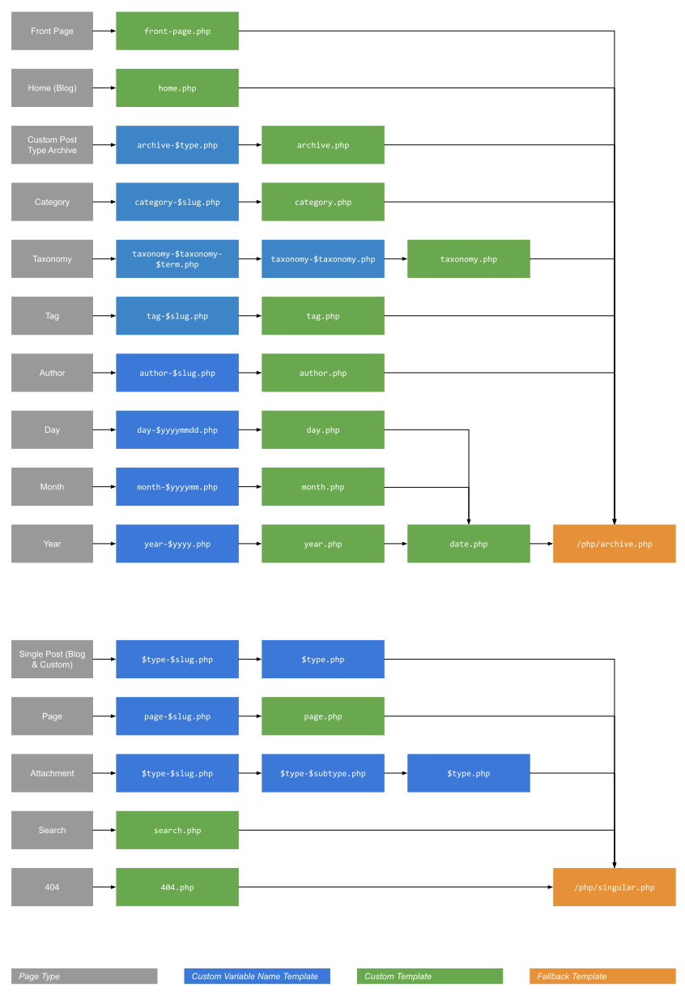

# File Structure

`@version     2.1.0`

This theme introduces some important changes in terms of file structure, compared to the standard WordPress theme structure. You should familiarize yourself first with [WordPress template hierarchy](https://developer.wordpress.org/themes/basics/template-hierarchy/).

From our experience the standard approach has a couple shortcomings:

* Each template must render the entire page, including calling `get_header()`, `get_footer()`, and `get_sidebar()`. While this provide a lot of flexibility, in practice we have found just creates repetitive code, and we believe it is better to control some of these elements using widgets instead. In our approach, there is a master page template that contains all header and footer code, and inserts the page template code in a specific point in the page.
* All template files are located on the root directory of the theme. This can cause this directory to become very cluttered and difficult to handle. In our approach, all template files are located at `/php/custom` instead.

While you can still create template files following WordPress template hierarchy, when using this theme we recommend you that you don't. Instead follow the structure described in this document.

### /index.php

Assuming that you don't create any template files in the root directory, all page requests will be captured by `/index.php`. The only function of this file is to call `/custom.php`.

### /custom.php

This is the main theme layout file. You can rename or copy `/custom.dist.php` and use it as a starting point. This file shows how you can leverage the various theme PHP files to load the following sections:

* `/php/vars.php`: initializes variables to be used by subsequent PHP files.
* `/php/meta.php`: renders various meta tags, both default ones and those controlled by theme options.
* `/php/css.php`: renders CSS link tags and generates consolidated CSS files.
* `/php/js.php`: renders script tags and generates consolidated JavaScript files.
* `/php/favicon.php`: renders the various favicon tags.
* `/php/body.php`: prepares before rendering the <body> tag.
* `/php/router.php`: identify the type of request and loads the appropriate template file.
* `/php/ie-alert.php`: renders IE alert HTML/CSS code.

Additionally, the various widget positions and menus are rendered only if they have any content.

### Router and Template Files

The router `/php/router.php` recreates the logic similar to the WordPress template hierarchy that identifies the correct template to use based on the type of page that has been requested, as shown in the diagram below:

The fallback templates for archive and singular pages are included in this theme and located at `/php/archive.php` and `/php/singular.php`. All the other templates are expected to be located at `/php/custom/` directory.

